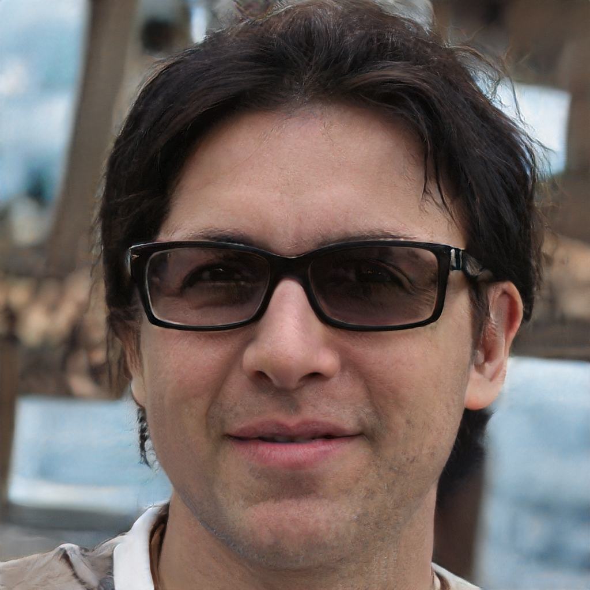
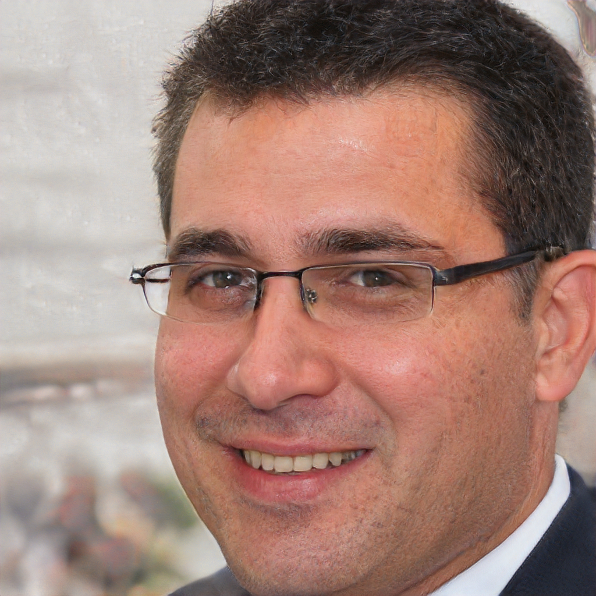

# Jessica Ryan

Jessica is a 21 year old cosplayer/student at the UofT.  She is currently taking a program in Computer Science and hopes to develop applications as her full-time job in the future. Aside from studying for exams and doing homework, Jessica likes to spend her time enjoying her anime hobby. Her favourite show is called Sword Art Online.

She likes to spend her time creating costumes of Asuna from SAO.  Jessica often attends local events and anime conventions to display her cosplay costumes. At events, she walks around the outside of the convention grounds and takes pictures with fans. Jessica has an older sister that was also a fan of several T.V. shows and she also liked to cosplay. 

Jessica's older sister inspired her to cosplay for the fandoms that she also liked. When designing and building costumes, Jessica likes to meet up with other cosplayers to design, shop, and build for costumes. After completion, Jessica attends conventions in a group of cosplay friends. 

As a more experienced cosplayer, Jessica is very familiar with taking pictures with large groups of people at large conventions. After spending a portion of the day cosplaying, Jessica likes to relax by walking around the convention grounds. She attends panels as well as fan meet ups for her favorite shows. Jessica also likes to purchase art as well as merchandise from vendors and artists alike.

As her main hobby, Jessica opts to attend as many conventions as she can while making time for school. 
Jessica's family remains supportive of her hobby, especially her sister. She helps Jessica pick out fabrics as well as design her costumes. Online, Jessica also sometimes participates in discussions/posts about her favourite shows. She likes to post images of her cosplay poses and outfits as well as discussion posts about. 

# Omar Cohke

Omar is a 43 year old store vendor. As a child, Omar grew up watching early cartoons like Transformers and Thundercats. Omar has been a fan of early cartoons ever since then. Omar's passion lead him to collect rare figures and merchandise of his favourite cartoons. 

In his University years at UBC, Omar decided to sell his rare merchandise to make some money in order to live more comfortably during University. During this time, Omar discovered that his merchandise could sell for a lot of money and in the process, Omar had made several fans of the same cartoons. The experience has lead Omar to continue to collect merchandise and resell to other fans. Omar opts to do this online on his spare time as well as attending conventions/events and selling there. Omar recently attended Anime North and displayed several articles of merchandise to sell to fans. Omar uses social media to advertise his vending. He lets the community know where/when/what is being sold at the events. Omar made thousands of dollars reselling rare figures over the convention weekend. 

Aside from working full-time as an accountant at Manulife Financial, Omar continues to make time for his hobby, collecting and selling figures and other merchandise. Omar makes a good living with his job and hobby. Omar lives uptown from the city in a studio apartment. On his spare time, Omar likes to rewatch old cartoon episodes and participates on social media groups specific towards the cartoons he is a fan of. 

Aside from a reseller, Omar considers himself to be an expert on specific shows and franchises such as Transformers and He-man. Online, he theorizes about cartoon worlds and intricacies of these cartoons on forum pages. Omar has written an essay on the symbolic meaning of why Optimus Prime transforms from a semi-truck. The essay has gained a lot of praise among the small crowd of Transformers experts.

.

## John von Mann

John is a 27 year old GIS (Geographic Information System) Specialist at Cartographic Inc. From the age of 14, he knew that he wanted to do something impactful and close to nature. He would spend his teenage years volunteering to plant trees and spent some time as a part time arborist. It lead John to a career where he collects geographic data to model and analyze to determine which areas of land are under the threat of various climate events.

His job requires him to constantly be travelling around the world and it is a very demanding job. In 2018, he has travelled repeatedly to the United States, Canada, Australia, China, Uzbekistan and Poland. He lives in a suitcase, spending more than 8 months away from home. In John's free time he plays the video game, Minecraft. He did not play video games when he was younger and has just started to discover video games. He considers himself a casual player since he does not have time to play very often. 

He would like to learn about the rich culture of Minecraft and meet people around his age who have just discovered video games. He wants to find a community of people who have similar interests but he does not care for all the minor details of Minecraft. John wants to be kept in the loop regarding new content but he does not want to know everything, just the largest features. He has increasingly more free time and would like to spend some of it playing video games. He would play more videos if he knew which video games he liked.

John sometimes visits social media websites to look up information about Minecraft. Since John is newer to the game, he is unfamiliar with common strategies and the specifics about in-game mechanics and interactablers. John visits these social media platforms from time to time and improves on his gameplay. John considers himself knowledgeable on topics relating to his profession, wine and highly knowledgeable on fictional dystopian literature. John is always edger to learn about cutting edge GIS technology.

John avoids items with Yellow 6 food colouring as it upsets his stomach. John is well known within the small competitive crochet world. He considers himself a "brochet" which means a "bro who crochets".